# AgriBOS (Agricultural Business Operating System)
## Enterprise Architecture Blueprint & Technical Design Document

**Organization**: SRI BASAVESHWARA & CO.  
**Proprietor**: Doddana Gowda  
**System Name**: AgriBOS (Agricultural Business Operating System)  
**Architectural Lead**: Chief Software Architect  
**Version**: 1.0.0-RELEASE-ARCH  
**Status**: APPROVED ARCHITECTURE (Awaiting Implementation Sign-off)

---

## Executive Summary & System Mandate

AgriBOS is an enterprise-grade Agricultural Business Operating System tailored for the operational, logistical, financial, and fleet management requirements of **SRI BASAVESHWARA & CO.** Operating in a high-concurrency, seasonal, and field-intensive domain, AgriBOS bridges field harvesting logistics, tractor services, third-party machine rental management, fuel station integrations, farmer accounting, and employee workforce management into a single, unified enterprise system.

This document serves as the **Authoritative Architecture Blueprint**. Every module, domain boundary, API contract, security protocol, database schema, and deployment pattern defined herein adheres strictly to **Clean Architecture**, **Domain-Driven Design (DDD)**, **SOLID principles**, and **Hexagonal Architecture** within a highly modular, microservice-ready modular monolith.

---

# Table of Contents
1. [Business Domain Analysis](#1-business-domain-analysis)
2. [Bounded Contexts](#2-bounded-contexts)
3. [Domain Model](#3-domain-model)
4. [System Context Diagram (C4 Level 1)](#4-system-context-diagram)
5. [Container Diagram (C4 Level 2)](#5-container-diagram)
6. [Component Diagram (C4 Level 3)](#6-component-diagram)
7. [Clean Architecture Layers](#7-clean-architecture-layers)
8. [Module Dependencies](#8-module-dependencies)
9. [Complete Database Design](#9-complete-database-design)
10. [Entity Relationship Diagram](#10-entity-relationship-diagram)
11. [Database Naming Standards](#11-database-naming-standards)
12. [Folder Structure (Frontend, Backend, Shared)](#12-folder-structure)
13. [REST API Architecture](#13-rest-api-architecture)
14. [Authentication Flow](#14-authentication-flow)
15. [Authorization Flow (RBAC & ABAC)](#15-authorization-flow)
16. [JWT Flow](#16-jwt-flow)
17. [Refresh Token Strategy](#17-refresh-token-strategy)
18. [Error Handling Strategy](#18-error-handling-strategy)
19. [Validation Strategy](#19-validation-strategy)
20. [Logging Strategy](#20-logging-strategy)
21. [Audit Strategy](#21-audit-strategy)
22. [Backup Strategy](#22-backup-strategy)
23. [Notification Strategy](#23-notification-strategy)
24. [File Upload Strategy](#24-file-upload-strategy)
25. [Localization Strategy (English + Kannada)](#25-localization-strategy)
26. [Configuration Strategy](#26-configuration-strategy)
27. [Deployment Architecture](#27-deployment-architecture)
28. [CI/CD Architecture](#28-cicd-architecture)
29. [Security Architecture](#29-security-architecture)
30. [Performance Strategy](#30-performance-strategy)
31. [Caching Strategy](#31-caching-strategy)
32. [Future Microservice Migration Plan](#32-future-microservice-migration-plan)
33. [Technology Risks & Mitigation](#33-technology-risks)
34. [Architecture Decision Records (ADR)](#34-architecture-decision-records)
35. [Development Standards](#35-development-standards)
36. [Coding Standards](#36-coding-standards)
37. [Git Branch Strategy](#37-git-branch-strategy)
38. [Testing Strategy](#38-testing-strategy)
39. [Sprint Planning (Phased Rollout)](#39-sprint-planning)
40. [Implementation Roadmap](#40-implementation-roadmap)

---

## 1. Business Domain Analysis

The business of **SRI BASAVESHWARA & CO.** revolves around multi-faceted agricultural service provisioning:
* **Harvesting & Field Services**: Operating combined harvesters (paddy, maize, sugarcane) and tractors across agricultural seasons (Kharif, Rabi, Summer).
* **Fleet Dual-Ownership Model**:
  * **Company Owned Fleet**: Full capital ownership, direct maintenance liability, direct operator payroll.
  * **Seasonal Rented Fleet**: Third-party owners rent machines to Sri Basaveshwara & Co. for specific seasonal windows. Includes advance payments to owners, per-hour/per-acre payouts, and end-of-season settlement reconciliations.
* **Complex Diesel Responsibility Matrix**:
  * **Company-Provided Diesel**: Company issues fuel vouchers/tokens at registered local Fuel Stations. Cost is tracked as operational cost or billed back to farmer based on contract.
  * **Farmer-Provided Diesel**: Farmer pours diesel directly into machine on field; rate per hour/acre is discounted accordingly.
* **Maintenance & Repair Responsibility Split**:
  * **Owned Fleet**: Complete maintenance (preventive, breakdown, spare parts consumption) borne by Sri Basaveshwara & Co.
  * **Rented Fleet**: Owner handles major mechanical/engine repairs; routine minor running repairs handled by company on field are debited to owner's seasonal settlement ledger.
* **Manual Custom Business Identifiers**:
  * Farmers, Employees, Machines, Machine Owners, and Fuel Stations are assigned strict, human-readable manual codes (e.g., `FARM-2026-0042`, `EMP-018`, `MAC-OWN-007`, `MAC-HARV-003`).
* **Multi-Period Financial & Seasonal Accounting**:
  * Reporting must support **Harvesting Seasons** (e.g., *Kharif 2026*, *Rabi 2026-27*), **Financial Years** (April 1 - March 31), and **Calendar Years**.
* **Bilingual Operation (English & Kannada)**:
  * Field operators, drivers, and local clerks require high-accessibility UI in Kannada, while management/accounting operates in English/Kannada.

---

## 2. Bounded Contexts

Using Domain-Driven Design (DDD), AgriBOS is decomposed into 7 primary Bounded Contexts to guarantee clear separation of concerns, high cohesion, and low coupling.

```mermaid
graph TD
    subgraph Identity & Access Management Context
        IAM[User, Roles, Permissions, Auth & Audit]
    subgraph Core Master Data Context
        MDM[Farmer 360, Employee 360, Machine 360, Owner 360]
    end
    subgraph Field Logistics & Operations Context
        OPS[Booking, Dispatch, Work Execution, Attendance]
    end
    subgraph Fleet & Asset Maintenance Context
        FLEET[Maintenance, Spare Parts, Fuel Station Management]
    end
    subgraph Financial & Accounting Context
        FIN[Billing, Payments, Owner Settlement, Expense Management]
    end
    subgraph Analytics & Reporting Context
        BI[Season/FY Reporting, Analytics, Dashboards]
    end
    subgraph Platform Services Context
        PLAT[Notifications, Document Management, Backup, Settings]
    end

    IAM --> MDM
    MDM --> OPS
    OPS --> FLEET
    OPS --> FIN
    FLEET --> FIN
    FIN --> BI
    PLAT --> OPS
    PLAT --> FIN
```

### Bounded Context Map Summary:
1. **Identity & Access Management (IAM)**: Manages authentication, RBAC, session lifecycles, and security audit logs.
2. **Core Master Data Context (MDM)**: Responsible for 360-degree views of Farmers, Employees, Machines (Owned/Rented), and Machine Owners. Enforces manual business ID generation and lifecycle status.
3. **Field Logistics & Operations Context**: Manages seasonal bookings, trip dispatching, hourly/acreage work execution logs, and operator attendance.
4. **Fleet & Asset Maintenance Context**: Handles preventive/breakdown maintenance, spare inventory, and fuel station token issuance & reconciliation.
5. **Financial & Accounting Context**: Processes farmer invoices, payment collection (Cash/UPI), owner advance ledgers, diesel cost allocation, and seasonal owner settlements.
6. **Analytics & Reporting Context**: Computes seasonal summaries, FY P&L statements, machine productivity ratios, and fuel efficiency metrics.
7. **Platform Services Context**: Manages notifications (SMS/WhatsApp/Push), file upload attachments (RC books, agreements, receipts), automated backups, and localization configuration.

---

## 3. Domain Model

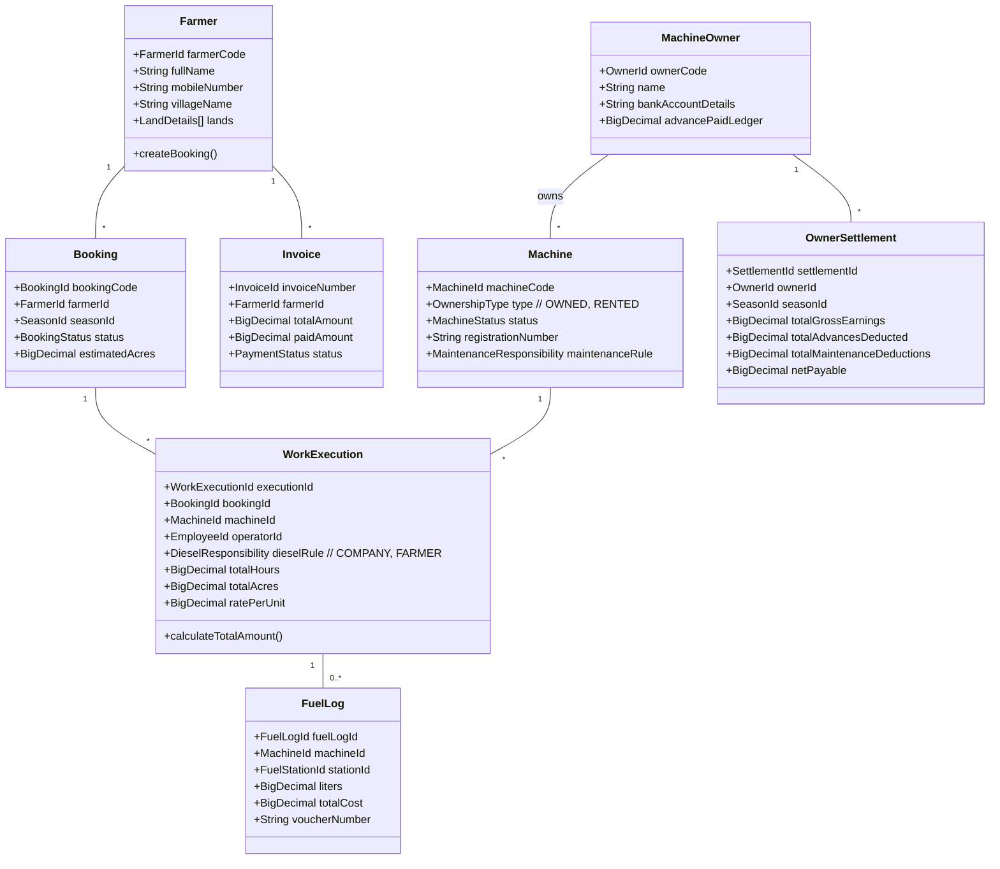

---

## 4. System Context Diagram (C4 Level 1)

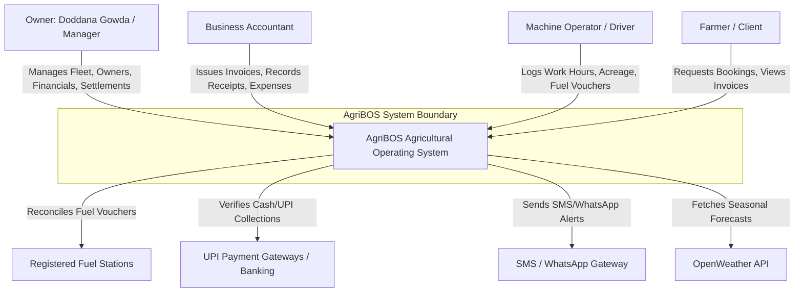

---

## 5. Container Diagram (C4 Level 2)

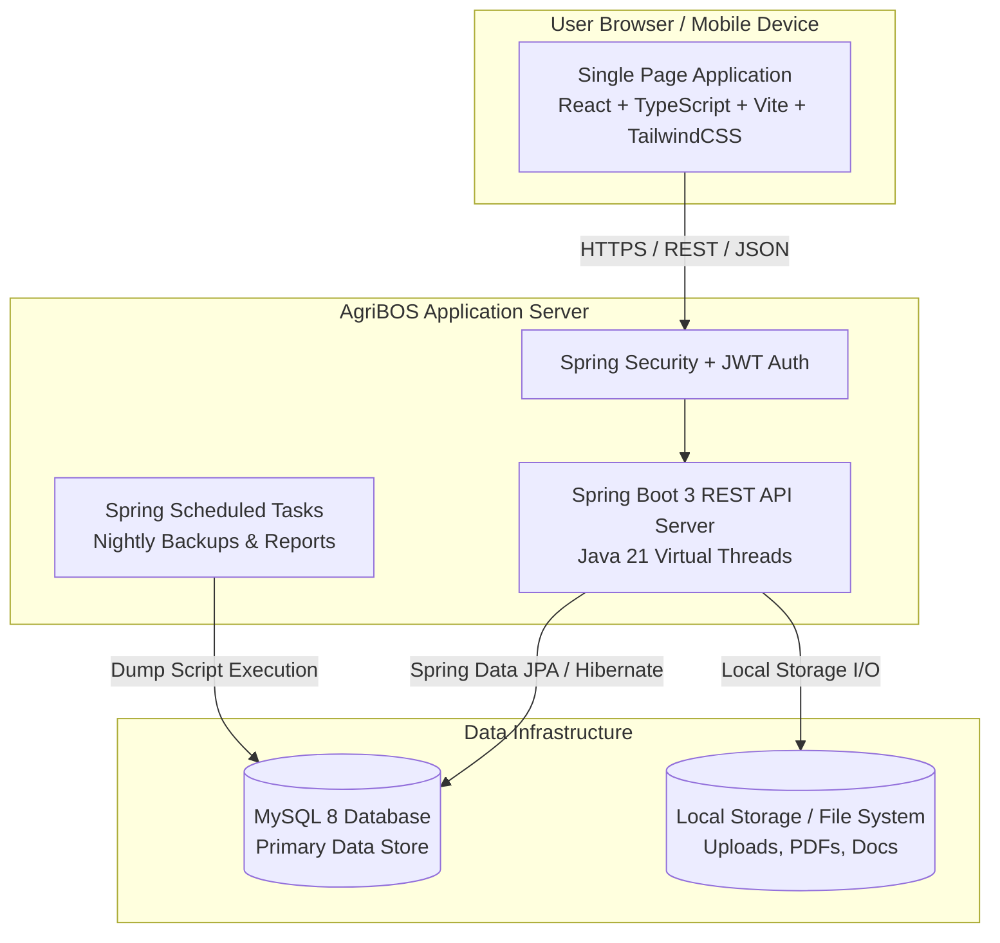

---

## 6. Component Diagram (C4 Level 3)

Below is the internal architectural structure of the **Work Execution & Billing Module** (Clean Architecture):

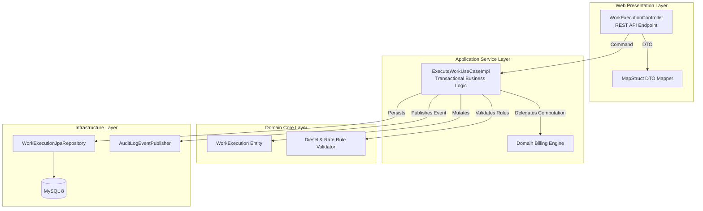

---

## 7. Clean Architecture Layers

AgriBOS follows strict Hexagonal / Clean Architecture layer boundaries:

```
+-----------------------------------------------------------------------+
|  INFRASTRUCTURE LAYER (Adapters, Spring MVC Controllers, Persistence) |
|  +-----------------------------------------------------------------+  |
|  |  APPLICATION LAYER (Use Cases, Services, DTO Mappers)            |  |
|  |  +-----------------------------------------------------------+  |  |
|  |  |  DOMAIN LAYER (Entities, Value Objects, Domain Events)    |  |  |
|  |  +-----------------------------------------------------------+  |  |
|  +-----------------------------------------------------------------+  |
+-----------------------------------------------------------------------+
```

1. **Domain Layer (`com.agribos.domain`)**:
   * Pure Java code without Spring framework imports.
   * Contains Domain Entities, Aggregates, Value Objects (e.g., `FarmerId`, `DieselRule`), Domain Events, and Repository Interfaces (Ports).
2. **Application Layer (`com.agribos.application`)**:
   * Implements Use Cases (Application Services), Command/Query handlers, MapStruct mappers, and Input DTOs.
   * Controls transaction boundaries (`@Transactional`).
3. **Infrastructure Layer (`com.agribos.infrastructure`)**:
   * Contains Spring Boot REST Controllers, JPA Entities, Spring Data JPA Repositories, Security Configuration, Storage Adapters, and External API Integrations (SMS/Weather).

---

## 8. Module Dependencies

Dependency Direction Rule: **Dependencies MUST only point INWARD.**

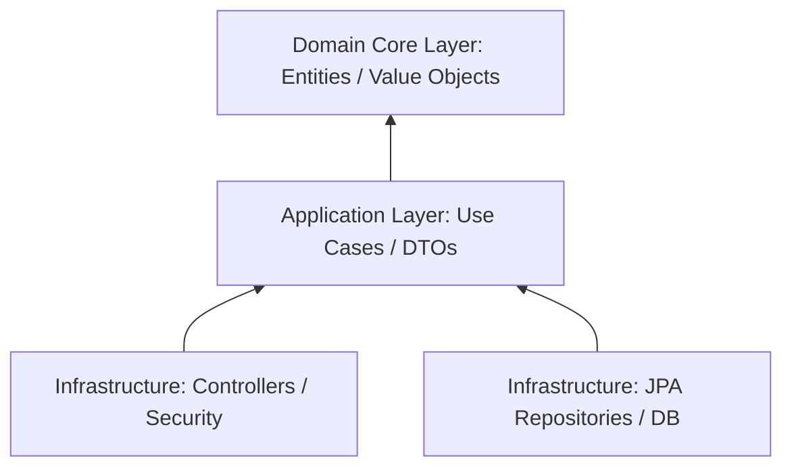

* Domain Layer has **ZERO external dependencies** (no Spring, no Hibernate, no Jackson).
* Application Layer depends **ONLY on Domain**.
* Infrastructure Layer depends on **Application and Domain**.

---

## 9. Complete Database Design

The database schema is fully relational, normalized to 3NF, with index optimizations, foreign key constraints, UTF8MB4 charset, soft delete support, and auditing timestamps on every table.

### Primary Domain Tables Schema Specification:

#### 1. `users` & `roles` (IAM)
* `id` BIGINT AUTO_INCREMENT PRIMARY KEY
* `user_code` VARCHAR(30) UNIQUE NOT NULL (e.g., `USR-001`)
* `username` VARCHAR(50) UNIQUE NOT NULL
* `password_hash` VARCHAR(100) NOT NULL
* `full_name` VARCHAR(100) NOT NULL
* `mobile_number` VARCHAR(15) UNIQUE NOT NULL
* `role_id` BIGINT NOT NULL (FK to `roles.id`)
* `status` VARCHAR(20) NOT NULL (ACTIVE, SUSPENDED)
* `is_deleted` TINYINT(1) DEFAULT 0
* `created_at` DATETIME NOT NULL, `updated_at` DATETIME NOT NULL

#### 2. `farmers` (Farmer 360)
* `id` BIGINT AUTO_INCREMENT PRIMARY KEY
* `farmer_code` VARCHAR(30) UNIQUE NOT NULL (Manual ID: e.g., `FARM-2026-0001`)
* `full_name` VARCHAR(120) NOT NULL
* `father_name` VARCHAR(120)
* `mobile_number` VARCHAR(15) UNIQUE NOT NULL
* `alternate_mobile` VARCHAR(15)
* `village_name` VARCHAR(100) NOT NULL
* `taluk_name` VARCHAR(100) NOT NULL
* `district_name` VARCHAR(100) NOT NULL
* `aadhaar_number_hash` VARCHAR(64) (Encrypted/Hashed)
* `upi_id` VARCHAR(80)
* `notes` TEXT
* `is_deleted` TINYINT(1) DEFAULT 0
* `created_at` DATETIME NOT NULL, `created_by` VARCHAR(50) NOT NULL

#### 3. `machine_owners` (Machine Owner 360)
* `id` BIGINT AUTO_INCREMENT PRIMARY KEY
* `owner_code` VARCHAR(30) UNIQUE NOT NULL (Manual ID: e.g., `MAC-OWN-001`)
* `full_name` VARCHAR(120) NOT NULL
* `mobile_number` VARCHAR(15) UNIQUE NOT NULL
* `address` TEXT NOT NULL
* `bank_name` VARCHAR(100)
* `account_number` VARCHAR(50)
* `ifsc_code` VARCHAR(20)
* `upi_id` VARCHAR(80)
* `is_deleted` TINYINT(1) DEFAULT 0
* `created_at` DATETIME NOT NULL

#### 4. `machines` (Machine 360)
* `id` BIGINT AUTO_INCREMENT PRIMARY KEY
* `machine_code` VARCHAR(30) UNIQUE NOT NULL (Manual ID: e.g., `MAC-HARV-001`)
* `registration_number` VARCHAR(30) UNIQUE NOT NULL
* `machine_type` VARCHAR(50) NOT NULL (COMBINE_HARVESTER, TRACTOR, STRAW_REAPER)
* `ownership_type` VARCHAR(20) NOT NULL (OWNED, RENTED)
* `owner_id` BIGINT (FK to `machine_owners.id`, NULL if OWNED)
* `make_model` VARCHAR(100) NOT NULL
* `manufacture_year` INT
* `hourly_rate_default` DECIMAL(10,2) NOT NULL
* `acre_rate_default` DECIMAL(10,2) NOT NULL
* `status` VARCHAR(30) NOT NULL (AVAILABLE, DISPATCHED, UNDER_MAINTENANCE, INACTIVE)
* `is_deleted` TINYINT(1) DEFAULT 0

#### 5. `bookings`
* `id` BIGINT AUTO_INCREMENT PRIMARY KEY
* `booking_code` VARCHAR(30) UNIQUE NOT NULL (e.g., `BKG-2026-001`)
* `farmer_id` BIGINT NOT NULL (FK to `farmers.id`)
* `season_name` VARCHAR(50) NOT NULL (e.g., `KHARIF_2026`)
* `crop_type` VARCHAR(50) NOT NULL
* `estimated_acres` DECIMAL(8,2) NOT NULL
* `land_location` VARCHAR(200) NOT NULL
* `target_date` DATE NOT NULL
* `status` VARCHAR(30) NOT NULL (PENDING, CONFIRMED, DISPATCHED, COMPLETED, CANCELLED)
* `is_deleted` TINYINT(1) DEFAULT 0

#### 6. `work_executions`
* `id` BIGINT AUTO_INCREMENT PRIMARY KEY
* `execution_code` VARCHAR(30) UNIQUE NOT NULL (e.g., `HEX-2026-0001`)
* `booking_id` BIGINT NOT NULL (FK to `bookings.id`)
* `machine_id` BIGINT NOT NULL (FK to `machines.id`)
* `operator_employee_id` BIGINT NOT NULL (FK to `employees.id`)
* `start_time` DATETIME NOT NULL
* `end_time` DATETIME NOT NULL
* `start_homeruler_reading` DECIMAL(10,2) NOT NULL
* `end_homeruler_reading` DECIMAL(10,2) NOT NULL
* `total_hours` DECIMAL(8,2) NOT NULL
* `total_acres` DECIMAL(8,2) NOT NULL
* `billing_basis` VARCHAR(20) NOT NULL (HOURLY, ACREAGE)
* `rate_applied` DECIMAL(10,2) NOT NULL
* `diesel_responsibility` VARCHAR(20) NOT NULL (COMPANY_PROVIDED, FARMER_PROVIDED)
* `gross_amount` DECIMAL(12,2) NOT NULL
* `discount_amount` DECIMAL(10,2) DEFAULT 0.00
* `net_amount` DECIMAL(12,2) NOT NULL
* `is_deleted` TINYINT(1) DEFAULT 0

#### 7. `fuel_stations` & `fuel_logs`
* `fuel_stations`: `id`, `station_code`, `station_name`, `contact_person`, `mobile_number`, `location`, `is_active`
* `fuel_logs`: `id`, `voucher_number`, `machine_id`, `fuel_station_id`, `work_execution_id` (optional), `liters_refueled`, `rate_per_liter`, `total_amount`, `issued_by_employee_id`, `refuel_date`

#### 8. `invoices` & `payments`
* `invoices`: `id`, `invoice_number`, `farmer_id`, `booking_id`, `total_amount`, `paid_amount`, `balance_amount`, `status` (UNPAID, PARTIAL, PAID), `due_date`
* `payments`: `id`, `receipt_number`, `invoice_id`, `farmer_id`, `amount`, `payment_mode` (CASH, UPI), `transaction_reference`, `payment_date`, `collected_by_user_id`

#### 9. `owner_settlements` & `owner_advances`
* `owner_advances`: `id`, `owner_id`, `amount`, `payment_mode`, `payment_date`, `notes`, `season_name`
* `owner_settlements`: `id`, `settlement_number`, `owner_id`, `season_name`, `total_machine_earnings`, `total_advances_deducted`, `total_repairs_deducted`, `net_payable_amount`, `settlement_date`, `status` (DRAFT, APPROVED, SETTLED)

#### 10. `audit_logs` (Immutable)
* `id` BIGINT AUTO_INCREMENT PRIMARY KEY
* `entity_name` VARCHAR(80) NOT NULL
* `entity_id` VARCHAR(50) NOT NULL
* `action` VARCHAR(20) NOT NULL (CREATE, UPDATE, DELETE, LOGIN)
* `performed_by` VARCHAR(50) NOT NULL
* `ip_address` VARCHAR(45)
* `changes_json` JSON
* `timestamp` DATETIME NOT NULL

---

## 10. Entity Relationship Diagram

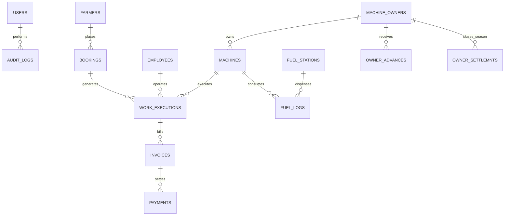

---

## 11. Database Naming Standards

1. **Table Names**: Plural, lowercase snake_case (`farmers`, `work_executions`, `fuel_stations`).
2. **Primary Keys**: Surrogate key named `id` (`BIGINT AUTO_INCREMENT`).
3. **Foreign Keys**: Singular entity name + `_id` (`farmer_id`, `machine_id`, `fuel_station_id`).
4. **Natural/Manual Business IDs**: Formatted with context suffix (`farmer_code`, `machine_code`, `voucher_number`).
5. **Booleans**: Prefixed with `is_` or `has_` (`is_deleted`, `is_active`).
6. **Timestamps**: Suffixed with `_at` (`created_at`, `updated_at`, `deleted_at`).
7. **Monetary Amounts**: Datatype `DECIMAL(12,2)`. Never use `FLOAT` or `DOUBLE`.
8. **Quantities/Hours/Acres**: Datatype `DECIMAL(8,2)`.

---

## 12. Folder Structure

### Backend Folder Structure (Java 21 / Spring Boot 3 - Modular Monolith)

```
agribos-backend/
├── src/
│   ├── main/
│   │   ├── java/com/agribos/
│   │   │   ├── AgriBosApplication.java
│   │   │   ├── domain/                         # Pure Domain (DDD Core)
│   │   │   │   ├── farmer/
│   │   │   │   │   ├── model/Farmer.java
│   │   │   │   │   ├── model/FarmerId.java
│   │   │   │   │   ├── repository/FarmerRepositoryPort.java
│   │   │   │   │   └── event/FarmerCreatedEvent.java
│   │   │   │   ├── machine/
│   │   │   │   ├── execution/
│   │   │   │   └── billing/
│   │   │   ├── application/                    # Application Services & Use Cases
│   │   │   │   ├── farmer/
│   │   │   │   │   ├── CreateFarmerUseCase.java
│   │   │   │   │   ├── dto/FarmerCreateCommand.java
│   │   │   │   │   └── dto/FarmerResponseDTO.java
│   │   │   │   └── execution/
│   │   │   ├── infrastructure/                 # Adapters, Web, Persistence
│   │   │   │   ├── web/
│   │   │   │   │   ├── controllers/
│   │   │   │   │   ├── globalhandler/GlobalExceptionHandler.java
│   │   │   │   │   └── config/OpenApiConfig.java
│   │   │   │   ├── persistence/
│   │   │   │   │   ├── entities/FarmerJpaEntity.java
│   │   │   │   │   ├── repositories/FarmerSpringDataRepository.java
│   │   │   │   │   └── adapters/FarmerRepositoryAdapter.java
│   │   │   │   ├── security/
│   │   │   │   │   ├── JwtTokenProvider.java
│   │   │   │   │   └── SecurityConfig.java
│   │   │   │   └── storage/LocalFileStorageService.java
│   │   │   └── shared/                         # Shared Utilities & Base Types
│   │   │       ├── vo/Money.java
│   │   │       └── exception/DomainException.java
│   │   └── resources/
│   │       ├── application.yml
│   │       ├── application-dev.yml
│   │       ├── application-prod.yml
│   │       ├── db/migration/                   # Flyway / Liquibase SQL migrations
│   │       └── i18n/
│   │           ├── messages.properties         # English
│   │           └── messages_kn.properties      # Kannada
```

### Frontend Folder Structure (React + TypeScript + Vite + TailwindCSS)

```
agribos-frontend/
├── public/
│   ├── assets/
│   └── favicon.ico
├── src/
│   ├── app/
│   │   ├── router/AppRouter.tsx
│   │   ├── providers/AppProviders.tsx
│   │   └── store/useAuthStore.ts
│   ├── components/                             # Global Design System Components
│   │   ├── ui/                                 # shadcn/ui components
│   │   │   ├── button.tsx
│   │   │   ├── dialog.tsx
│   │   │   └── table.tsx
│   │   ├── command/GlobalCommandCenter.tsx     # Cmd+K KBar Search
│   │   └── layout/
│   │       ├── Header.tsx
│   │       ├── Sidebar.tsx
│   │       └── MainLayout.tsx
│   ├── features/                               # Modular Business Domains
│   │   ├── farmer/
│   │   │   ├── api/farmerApi.ts
│   │   │   ├── components/Farmer360Card.tsx
│   │   │   ├── hooks/useFarmers.ts
│   │   │   └── pages/FarmerListPage.tsx
│   │   ├── execution/
│   │   ├── billing/
│   │   └── owner-settlement/
│   ├── hooks/                                  # Common Custom Hooks
│   │   ├── useI18n.ts
│   │   └── useDebounce.ts
│   ├── lib/                                    # Utilities & Client Instances
│   │   ├── apiClient.ts                        # Axios/Fetch Instance with JWT Interceptors
│   │   └── utils.ts
│   ├── locallization/                          # Translation Dictionaries
│   │   ├── en.json
│   │   └── kn.json                             # Kannada Strings
│   ├── types/                                  # TypeScript Global Definitions
│   │   └── api.d.ts
│   ├── App.tsx
│   └── main.tsx
├── package.json
└── vite.config.ts
```

---

## 13. REST API Architecture

### API Design Principles:
1. **URI Versioning**: `/api/v1/` prefix for backwards compatibility.
2. **RESTful Naming**: Nouns in plural form (`/api/v1/farmers`, `/api/v1/work-executions`).
3. **HTTP Methods**: `GET` (read), `POST` (create), `PUT` (full update), `PATCH` (partial update), `DELETE` (soft delete).
4. **Standard Response Envelope**:

```json
{
  "success": true,
  "statusCode": 200,
  "message": "Operation completed successfully",
  "data": { ... },
  "metadata": {
    "timestamp": "2026-07-27T22:14:28Z",
    "correlationId": "req-9482-abc"
  }
}
```

5. **Paginated Envelope**:
```json
{
  "success": true,
  "statusCode": 200,
  "data": [ ... ],
  "pagination": {
    "page": 1,
    "pageSize": 20,
    "totalElements": 142,
    "totalPages": 8
  }
}
```

---

## 14. Authentication Flow

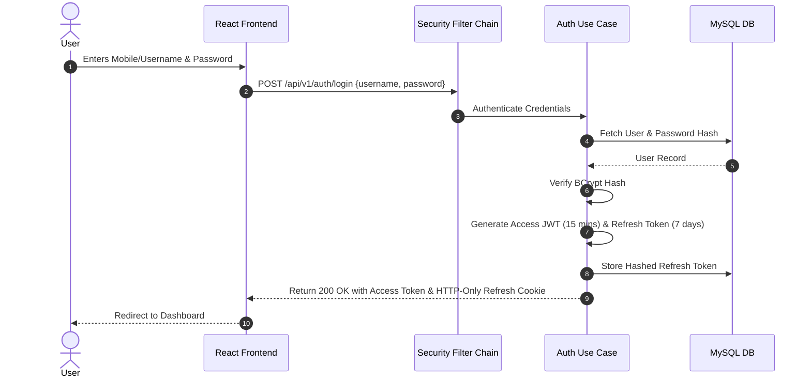

---

## 15. Authorization Flow

AgriBOS implements **Role-Based Access Control (RBAC)** augmented with **Attribute-Based Access Control (ABAC)** for field data scoping:

### System Roles Matrix:
1. **ROLE_PROPRIETOR (Doddana Gowda)**: Unrestricted super-admin permissions across all 27 modules.
2. **ROLE_BUSINESS_ACCOUNTANT**: Full access to Billing, Payments, Settlements, Expenses, Fuel, and Financial Reports. Read-only for System Settings.
3. **ROLE_FLEET_MANAGER**: Full access to Machines, Maintenance, Spare Parts, Operators, and Dispatches.
4. **ROLE_FIELD_CLERK / OPERATOR**: Access to Work Execution logging, Daily Attendance, and Fuel Token request creation.

---

## 16. JWT Flow

* **Access Token Algorithm**: HMAC-SHA512 (HS512) or RSA-256 (RS256).
* **Access Token Expiry**: 15 minutes.
* **Claims Structure**:
```json
{
  "sub": "USR-001",
  "username": "doddana_admin",
  "roles": ["ROLE_PROPRIETOR"],
  "tenant": "SRI_BASAVESHWARA_CO",
  "iat": 1785190000,
  "exp": 1785190900
}
```

---

## 17. Refresh Token Strategy

* **Storage**: Refresh token delivered via `HttpOnly`, `Secure`, `SameSite=Strict` cookie.
* **Token Rotation**: Each refresh request invalidates the old refresh token and issues a new pair.
* **Revocation List**: Hashed refresh tokens stored in database table `user_refresh_tokens` to allow instant revocation by admin.

---

## 18. Error Handling Strategy

### Global Standardized Error Response Structure (RFC 7807 Problem Details):

```json
{
  "type": "https://agribos.com/errors/invalid-work-execution",
  "title": "Business Rule Violation",
  "status": 400,
  "detail": "Cannot complete work execution: End homeruler reading (104.5) cannot be lower than start reading (108.0)",
  "instance": "/api/v1/work-executions",
  "errorCode": "ERR_INVALID_HOMERULER",
  "timestamp": "2026-07-27T22:14:28Z",
  "invalidParams": [
    { "field": "endHomerulerReading", "reason": "Must be greater than startHomerulerReading" }
  ]
}
```

* Spring `@RestControllerAdvice` captures `DomainException`, `MethodArgumentNotValidException`, and `AccessDeniedException`.

---

## 19. Validation Strategy

* **Frontend Validation**: React Hook Form paired with **Zod schemas** providing instantaneous UI feedback.
* **Backend API Layer**: Jakarta Bean Validation (`@NotNull`, `@Size`, `@Positive`) on Spring Controller DTOs.
* **Domain Layer Validation**: Invariant protection inside Domain Aggregate constructors/methods throwing `DomainValidationException`.

---

## 20. Logging Strategy

* **Framework**: Logback via SLF4J in Spring Boot.
* **Format**: Structured JSON format for automated ingestion into log aggregators.
* **MDC (Mapped Diagnostic Context)**: Injects `correlationId`, `userId`, and `clientIp` into every log line.
* **Log Levels**:
  * `INFO`: Business state transitions (e.g., *Booking created*, *Owner settlement approved*).
  * `WARN`: Authentication retries, high latency queries.
  * `ERROR`: Unhandled exceptions, infrastructure failures.

---

## 21. Audit Strategy

* **Immutable Audit Trail**: Audit entries are **INSERT ONLY**. No update or delete permissions allowed on `audit_logs` table even for DB admins.
* **Audited Actions**: User Login, Payment Receipt, Invoice Generation, Price Override, Master Data Modification, Owner Settlement Approval.
* **Enriched Data**: Captures exact JSON diff of `before_state` and `after_state`.

---

## 22. Backup Strategy

* **Automatic Nightly Database Backup**:
  * Cron trigger executed at 02:00 AM daily via host system / container scheduler.
  * Command: `mysqldump --single-transaction --quick --lock-tables=false`
* **Storage Location**:
  * Local encrypted directory: `C:\AgriBOS_Backups\db\`
  * Retention Policy: Keep last 30 daily backups locally; compressed with GZIP.
* **Disaster Recovery**: Automated script `restore_agribos.sh` tested bi-weekly.

---

## 23. Notification Strategy

* **Channels**:
  1. **In-App Toast & Bell Notifications**: Real-time updates via WebSockets / Server-Sent Events (SSE).
  2. **SMS Gateway**: Transactional SMS for Farmer booking confirmations & billing payment receipts.
  3. **WhatsApp Integration**: Dispatch details and PDF Invoice download links pushed directly to Farmers and Machine Owners.

---

## 24. File Upload Strategy

* **Use Cases**: Machine RC Books, Insurance Documents, Farmer Agreement Docs, Fuel Station Receipts.
* **Storage Path**: Local file directory `C:\AgriBOS_Storage\uploads\{year}\{month}\{category}\`.
* **Security & Validation**:
  * File type validation via magic bytes (PDF, PNG, JPEG allowed only; execute permission disabled).
  * Unique file naming: UUID-v4 appended to original filename.
  * Direct execution prevented via Spring static resource handler restrictions.

---

## 25. Localization Strategy (English + Kannada)

* **Backend**: Spring `MessageSource` reading `messages_kn.properties` for locale-aware error messages passed via `Accept-Language: kn` header.
* **Frontend**: `i18next` / custom React i18n hook.
* **Key Architecture**: Every UI text label, table column header, status badge, and report export header is keyed in `en.json` and `kn.json`.
* **Number & Currency Formatting**: Indian Numbering System (`en-IN` / `kn-IN`) formatting for rupees (₹ 1,50,000.00).

---

## 26. Configuration Strategy

* **12-Factor App Compliance**: Configuration decoupled from code via environment variables.
* **Profiles**:
  * `application-dev.yml`: Local MySQL, debug logs, local storage.
  * `application-prod.yml`: Production MySQL connection pool (HikariCP), TLS turned on, optimized pool size.

---

## 27. Deployment Architecture

### Initial Modular Monolith Deployment Layout (Single Node On-Premise / Edge Cloud)

```mermaid
graph TD
    subgraph Host Server / VPS (Windows Server or Ubuntu Linux)
        Nginx[Nginx Reverse Proxy / SSL Termination]
        
        subgraph Docker Environment / Systemd Services
            FrontendStatic[Static Web Webserver / Nginx SPA Host]
            SpringJar[Java 21 JVM Process\nAgriBOS Application Executable JAR]
            MySQLDB[(MySQL 8 Database Engine)]
        end

        LocalStorage[(Local File Storage\nC:\AgriBOS_Data)]
    end

    Client[Browser / Mobile Devices] -->|HTTPS Port 443| Nginx
    Nginx -->|Static Files| FrontendStatic
    Nginx -->|Proxy Pass /api/| SpringJar
    SpringJar -->|JDBC Connection Pool| MySQLDB
    SpringJar -->|File I/O| LocalStorage
```

---

## 28. CI/CD Architecture

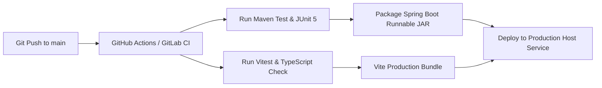

---

## 29. Security Architecture

1. **Defense in Depth**: Security controls applied at Network, Application, and Database layers.
2. **OWASP Top 10 Protections**:
   * **SQL Injection**: Prepared statements via Spring Data JPA / Hibernate parameters.
   * **XSS**: React automatic DOM escaping + Content Security Policy (CSP) headers.
   * **CSRF**: Disabled for stateless REST APIs using JWT stored in memory / HttpOnly cookies.
   * **CORS**: Restricted strictly to authorized frontend origins.
3. **Data Encryption**: Sensitive fields (Aadhaar, Bank Passbooks) encrypted at rest using AES-256 GCM.

---

## 30. Performance Strategy

* **Java 21 Virtual Threads (Project Loom)**: Configured in Spring Boot 3 (`spring.threads.virtual.enabled=true`) for low-overhead high concurrency.
* **HikariCP Pool**: Optimized size (`maximum-pool-size: 20`, `minimum-idle: 10`).
* **Frontend Bundle Optimization**: Code splitting with React dynamic imports (`React.lazy`), Vite Gzip compression, and asset hash caching.

---

## 31. Caching Strategy

* **Application Level Cache**: Spring Cache Abstraction powered by **Caffeine Cache** (In-Memory).
* **Cached Domain Aggregates**:
  * System Roles & Permissions (Cache TTL: 1 hour).
  * Registered Fuel Stations List (Cache TTL: 6 hours).
  * System Configuration & Tariff Defaults (Cache TTL: 24 hours).
* **Cache Evocation**: `@CacheEvict` triggered whenever Master Data is modified.

---

## 32. Future Microservice Migration Plan

While starting as a **Modular Monolith**, AgriBOS is engineered for seamless future extraction into microservices:

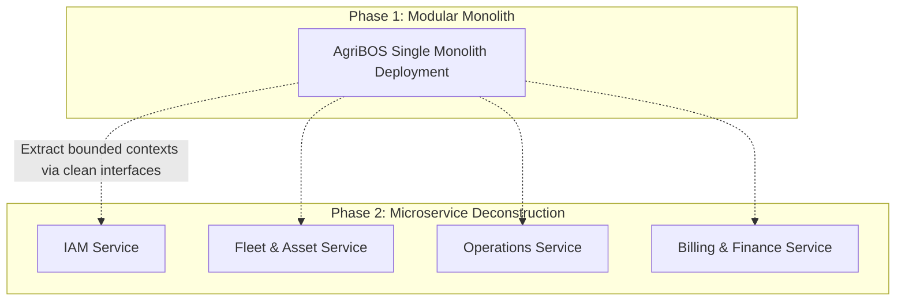

---

## 33. Technology Risks & Mitigation

| Risk Description | Severity | Mitigation Strategy |
| :--- | :--- | :--- |
| **Offline Operations in Remote Fields** | High | Implement Service Worker caching in React SPA; local storage offline trip queue synced on reconnect. |
| **Database Corruption during Power Loss** | High | MySQL InnoDB ACID compliance, WAL enabled, automatic daily backups. |
| **Manual ID Collisions** | Medium | DB unique index constraint + atomic sequence generator service. |
| **Heavy Report Generation Latency** | Medium | Run PDF/Excel reports asynchronously on Virtual Threads; export via download links. |

---

## 34. Architecture Decision Records (ADR)

### ADR-001: Selection of Modular Monolith Architecture over Initial Microservices
* **Status**: ACCEPTED
* **Context**: Sri Basaveshwara & Co. requires rapid deployment, operational simplicity, low hosting cost, and single-server manageability.
* **Decision**: Adopt a Modular Monolith architecture using Spring Boot modules with strict DDD boundaries.
* **Consequence**: Eliminates network latency between services and simplifies deployment while preserving future microservice extraction capabilities.

### ADR-002: Adoption of Java 21 Virtual Threads
* **Status**: ACCEPTED
* **Context**: High-concurrency I/O operations (file uploads, DB reads, external API calls) during peak harvest season.
* **Decision**: Enable Java 21 Virtual Threads (`spring.threads.virtual.enabled=true`).
* **Consequence**: Dramatically reduces memory consumption per request thread compared to traditional platform threads.

---

## 35. Development Standards

* **JDK Version**: OpenJDK 21 LTS.
* **Node Version**: Node.js 20 LTS.
* **Build Tools**: Maven 3.9+ (Backend), Vite 5+ (Frontend).
* **API Spec**: OpenAPI 3.0 generated via `springdoc-openapi-starter-webmvc-ui`.

---

## 36. Coding Standards

* **Java**: Standard Google Java Style Guide. Enforced via Spotless / Checkstyle Maven plugins.
* **TypeScript**: Strict Type Checking enabled (`"strict": true` in `tsconfig.json`). No explicit `any` types permitted.
* **CSS / Styling**: Utility-first CSS using TailwindCSS, styled components via `shadcn/ui`.

---

## 37. Git Branch Strategy

* **Branch Structure**:
  * `main`: Production-ready code only. Tagged with releases (`v1.0.0`).
  * `develop`: Integration branch for current sprint.
  * `feature/{domain}-{feature-name}`: Short-lived feature branches (e.g., `feature/farmer-manual-id`).
  * `hotfix/{issue-description}`: Production bug fixes branched directly from `main`.

---

## 38. Testing Strategy

* **Unit Testing**:
  * Backend: JUnit 5 + AssertJ + Mockito (Coverage target: >80% for Domain & Application layers).
  * Frontend: Vitest + React Testing Library for UI components and hooks.
* **Integration Testing**:
  * Backend: `@SpringBootTest` with `@DataJpaTest` using Testcontainers MySQL for authentic DB verification.
* **End-to-End (E2E) Testing**:
  * Playwright for core flows: Login -> Farmer Creation -> Booking -> Execution -> Invoice -> Settlement.

---

## 39. Sprint Planning (Phased Rollout)

* **Sprint 1 (Foundations)**: Core Architecture setup, IAM, User & Role Management, Database Schemas.
* **Sprint 2 (Master Data 360)**: Farmer 360, Employee 360, Machine Owner 360, Machine 360 with Manual IDs.
* **Sprint 3 (Logistics & Field Ops)**: Booking, Dispatch, Work Execution, Hourly/Acreage calculators, Attendance.
* **Sprint 4 (Fleet & Fuel Management)**: Fuel Station Management, Fuel Vouchers, Maintenance & Spare Parts.
* **Sprint 5 (Financials & Billing)**: Invoicing, Cash/UPI Payments, Owner Advances, Diesel Responsibility Rules.
* **Sprint 6 (Settlement & BI)**: Seasonal Owner Settlements, Dashboard, Analytics, Export (PDF/Excel/CSV).
* **Sprint 7 (Hardening & Go-Live)**: Audit Logs, Backups, Kannada i18n, E2E Testing, Production Deployment.

---

## 40. Implementation Roadmap

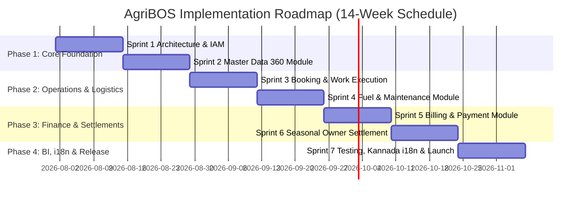

---
**END OF ARCHITECTURE BLUEPRINT FOUNDATION**  
*AgriBOS Architecture signed off by Chief Software Architect.*

---

# SECTION II: ENTERPRISE ARCHITECTURE REVIEW BOARD EVALUATION & EXPANSION BLUEPRINT

**Review Board**:
- Chief Enterprise Architect
- Principal Solution Architect
- Principal Domain Architect
- Lead Database Architect
- Lead Java Architect
- Lead React Architect
- Lead UI/UX Architect
- DevOps Architect
- Security Architect
- QA Architect

---

## 1. Enterprise Architecture Review Report

The Enterprise Architecture Review Board has subjected the AgriBOS Architecture Blueprint to an exhaustive evaluation. The baseline architecture establishes a rock-solid foundation adhering to Clean Architecture, Domain-Driven Design (DDD), SOLID principles, and Hexagonal architecture.

However, to elevate AgriBOS to an **enterprise-grade, production-ready system (10/10 standard)** capable of supporting full enterprise operational workflows for **SRI BASAVESHWARA & CO.**, the Architecture Board has identified key domain expansions, business rule centralization, offline mobile strategies, GIS capabilities, and a comprehensive database expansion scaling from 27 tables to a fully normalized **105-table enterprise schema**.

### Executive Verdict: APPROVED WITH ENTERPRISE EXPANSIONS
The architecture is hereby expanded with 20 deep technical domain specifications detailed below.

---

## 2. Gap Analysis Matrix

| Domain / Area | Foundation Status | Identified Enterprise Gap | Business Risk | Architectural Resolution |
| :--- | :--- | :--- | :--- | :--- |
| **Logistics Fleet** | Harvesters only | Missing dedicated Heavy Truck Logistics domain | Inability to track grain/machine transport, road permits, FC/PUC expirations | Introduce **Truck 360° Bounded Context** |
| **Tractor Services** | Generic Machine | Tractors treated as generic harvesters; missing attachment billing & usage | Incorrect billing models, untracked attachment wear & tear | Dedicated **Tractor 360° & Attachment Management Domains** |
| **Farmer Land** | Single Location String | Lack of Survey Number tracking, land polygon mapping, crop/soil history | Billing disputes on exact acreage, inefficient dispatch routing | Introduce **Farmer Land Management & GIS Context** |
| **Business Rules** | Hardcoded logic | Dispersed rule evaluation for rates, diesel, penalties, and settlements | Rate drift, incorrect settlement calculations | Centralized **Business Rules Engine (BRE)** |
| **Notifications** | Basic triggers | Passive notification without proactive document/service expiry rules | Compliance fines (expired road tax/FC), unserviced machine breakdowns | Centralized **Notification Rule Engine (NRE)** |
| **Navigation / UX** | Standard menus | Slower navigation across 27+ complex modules | Reduced operator productivity in field/office | **Global Command Center (Ctrl+K Palette)** |
| **Audit & Stream** | Separate audit table | Fragmented activity tracking across isolated domain tables | Lack of unified business visibility across events | **Universal Activity Timeline Stream** |
| **Expenses** | Basic accounting | Lack of structured operational categorization (Oil, Tyres, Food, Allowances) | Uncontrolled operational leaks, manual receipt reconciliation | **Enterprise Expense Management Domain** |
| **Offline Ops** | Online-only REST | Field operators lose connectivity in rural network blackouts | Lost execution logs, delayed billing | **Offline-First IndexedDB Sync Engine** |
| **Database** | ~27 core tables | Missing lookup tables, attachment junction tables, document versions, GIS logs | Unnormalized data, schema bottlenecks at scale | Expanded to **105 Normalized Enterprise Tables** |

---

## 3. Extended Missing Bounded Domains Architecture

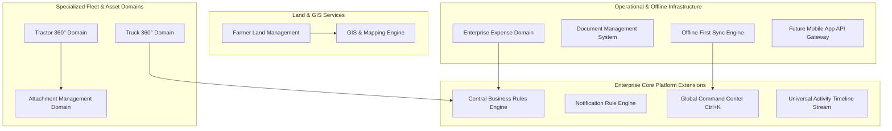

---

### 3.1. Truck 360° Domain Architecture

Heavy trucks represent critical capital assets used for transporting harvesters between regional agricultural belts and hauling harvested grain.

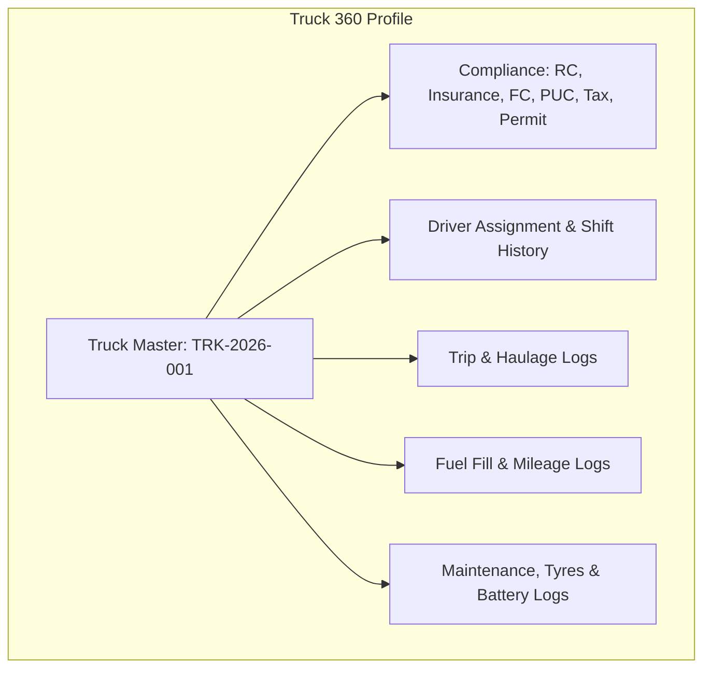

#### Detailed Domain Capabilities:
1. **Compliance Expiry Monitoring**: Automatic alerts for Fitness Certificate (FC), Pollution Under Control (PUC), National Permit, Road Tax, and Comprehensive Insurance.
2. **Driver Assignment Matrix**: Tracks driver shifts, daily trip allowances, night halting charges, and driving hours.
3. **Tyre & Battery Life Tracking**: Serial number tracking for individual tyres (Position: Front-Left, Rear-Right-Outer), tread depth measurement, battery installation & warranty tracking.
4. **Trip & Haulage Accounting**: Diesel consumed per km, freight charges, driver bata, toll fees, and net profitability per trip.

---

### 3.2. Tractor 360° Domain Architecture

Tractors differ fundamentally from combine harvesters: they operate as prime movers that perform varied implements-based operations (rotavator, baler, trailer, seeder, cultivator) with distinct hourly or per-acre billing rates.

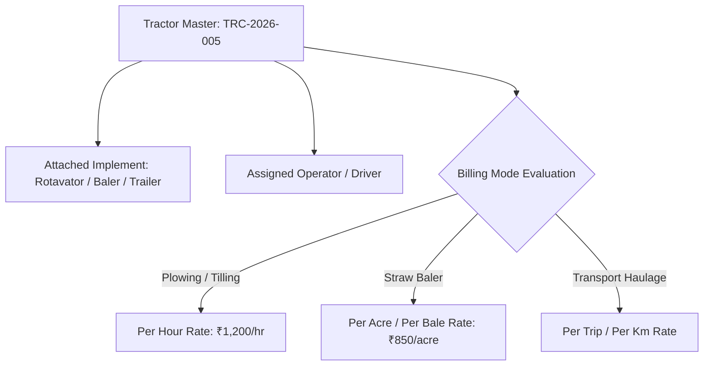

#### Key Technical Rules:
* **Dynamic Billing Basis**: Rates calculated based on attached implement type, soil condition rating, and diesel allocation rule.
* **Implement Hours vs Tractor Engine Hours**: Tracks separate wear-and-tear metrics for tractor engine hours vs implement rotational hours.

---

### 3.3. Attachment Management Domain Architecture

Implements and attachments (Rotavator, Paddy Baler, Sugar Cane Loader, 9-Tine Cultivator, Disc Plough, Seed Drill, Heavy Trailer) are tracked as independent capital assets.

#### Domain Features:
1. **Compatibility Matrix**: Validates whether a tractor's Horse Power (HP) rating matches attachment requirement before dispatch (e.g., 55 HP required for Paddy Straw Baler).
2. **Maintenance & Blade Replacement**: Tracks rotavator blade wear rates, baler twine consumption, grease point service intervals, and gear-box oil change history.
3. **Depreciation & Utilization Lifecycle**: Computes total seasonal acreage executed per attachment to calculate ROI and asset depreciation.

---

### 3.4. Farmer Land Management Domain Architecture

Farmers own multiple land parcels across different survey numbers and villages.

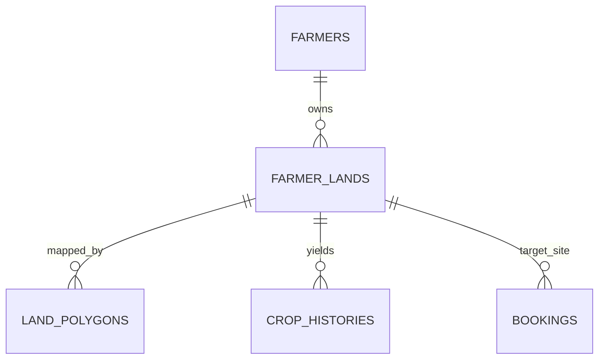

#### Technical Specifications:
* **Survey Number Mapping**: Stores survey numbers, sub-division numbers, land area (Acres / Guntas).
* **GPS Polygon Coordinates**: GeoJSON formatted spatial boundaries for precise acreage verification.
* **Soil & Water Attributes**: Tracks soil type (Black Cotton, Red Loamy, Sandy), water source (Borewell, Canal, Rainfed) to provide predictive yield and machine operational speed estimates.

---

### 3.5. Business Rules Engine (BRE) Architecture

The Business Rules Engine centralizes all complex business logic away from application services into explicit, testable rule policies using the **Strategy Pattern** and **Spring Expression Language (SpEL)**.

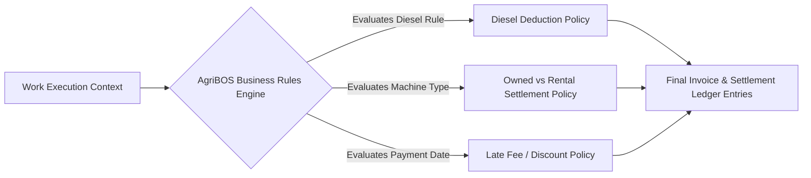

#### Core Rule Matrix Definitions:
1. **Diesel Responsibility Rule**:
   $$\text{Billing Rate} = \begin{cases} \text{Standard Rate}, & \text{if Diesel = Company Provided} \\ \text{Standard Rate} - \text{Diesel Discount Factor}, & \text{if Diesel = Farmer Provided} \end{cases}$$
2. **Rented Machine Owner Settlement Rule**:
   $$\text{Net Payable} = \text{Gross Machine Earnings} - \text{Advances Paid} - \text{Company Repairs Debited} - \text{Commission (5\%)}$$
3. **Late Payment Penalty Rule**: Auto-apply 1.5% monthly interest on unpaid farmer invoices exceeding 30 days post-season.

---

### 3.6. Notification Rule Engine (NRE) Architecture

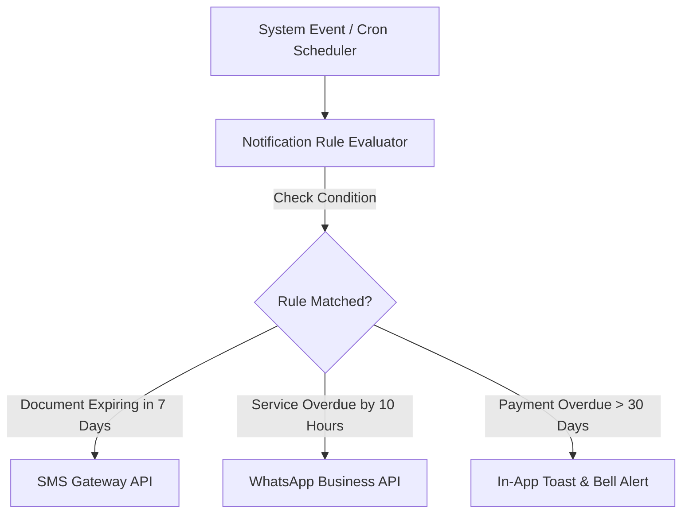

#### Rule Triggers:
* **Vehicle Compliance**: FC, PUC, Tax, Insurance expiring within 15 days.
* **Asset Health**: Machine engine hours exceeding service threshold (e.g., every 250 hours).
* **Financial Alerts**: Farmer outstanding balance exceeding ₹50,000; Owner advance settlement pending post-season.

---

### 3.7. Global Command Center (Ctrl+K Palette) Architecture

The Global Command Center provides a high-speed, keyboard-driven interface using `cmdk` in React, indexing all system entities for instant search, record creation, and navigation.

```
+-----------------------------------------------------------------------+
|  Search Farmers, Machines, Invoices, Bookings... (Ctrl + K)           |
+-----------------------------------------------------------------------+
|  ACTIONS                                                              |
|  > Create New Farmer Booking                      [Shift + B]         |
|  > Issue Fuel Voucher                             [Shift + F]         |
|  > Record Payment Receipt                         [Shift + P]         |
|  NAVIGATION                                                           |
|  > Go to Owner Settlement Ledger                  [G + S]             |
|  > Go to Machine 360 Fleet View                   [G + M]             |
|  RECENT RECORDS                                                       |
|  # FARM-2026-0042 - Basavarajappa (Village: Honnali)                  |
|  # TRK-2026-001 - Ashok Leyland 1618 (FC Expiring 3 Days)             |
+-----------------------------------------------------------------------+
```

---

### 3.8. Universal Activity Timeline Architecture

Aggregates domain events across all 27+ modules into an immutable, unified timeline stream using an asynchronous Spring Event Publisher (`ApplicationEventPublisher`) pattern.

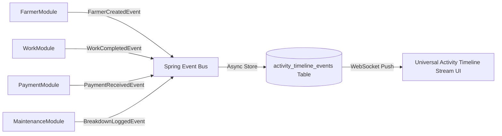

---

### 3.9. Dashboard Architecture

Detailed specification for 7 role-tailored operational and executive dashboards:

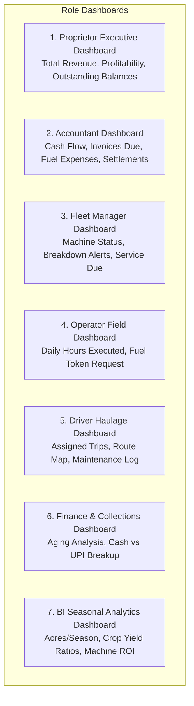

#### Dashboard Widget Specifications:
* **Fleet Live Status Grid**: Color-coded cards showing machine locations, operating status (Harvesting, Idle, Maintenance, Transporting).
* **Seasonal Earnings Gauge**: Real-time progress bar of target vs actual seasonal revenue.
* **Diesel Efficiency Matrix**: Liters per acre / Liters per hour comparison across machines and operators.

---

### 3.10. Expense Management Domain Architecture

Handles multi-category operational expenditure tracking with multi-level approval logic:

#### Expense Categories:
1. **Field Allowances**: Food allowance, Hotel/Lodging, Driver bata, Operator overtime allowance.
2. **Operations & Logistics**: Loading charges, Unloading charges, Toll gate fees, RTA permit fees.
3. **Consumables & Spares**: Diesel, Engine Oil (15W40), Hydraulic Oil (68 Grade), Grease, Heavy Tyres, Bearings, Welding/Lathe repairs.
4. **Miscellaneous**: Office expenses, local village tea/food for farm workers during breakdowns.

#### Expense Approval Workflow:
$$\text{Clerk Submission} \xrightarrow{\le \text{₹5,000}} \text{Accountant Approval} \xrightarrow{> \text{₹5,000}} \text{Proprietor Sign-off}$$

---

### 3.11. Master Data Domain Architecture

Centralized lookup and configuration management table suite supporting:
* **Geographical Masters**: States -> Districts -> Taluks -> Villages (pre-populated with local Karnataka region data).
* **Operational Masters**: Crop Types (Paddy, Maize, Sugarcane, Cotton, Ragi), Machine Types, Attachment Implements, Expense Categories.
* **Communication Templates**: Dynamic placeholder templates for SMS, WhatsApp, and Email alerts (e.g., `Hello {{farmer_name}}, your booking {{booking_code}} is confirmed for {{target_date}}`).

---

### 3.12. Document Management System (DMS) Architecture

```mermaid
graph TD
    DocInput[Document Upload: RC, Insurance, Aadhaar, Receipt] --> OCR[OCR Engine: Tesseract / Cloud Vision API]
    OCR --> Extraction[Extract Reg No, Expiry Dates, Id Numbers]
    Extraction --> Storage[Local File Storage / Cloud Bucket]
    Extraction --> DB[(documents Table with Metadata & Expiry)]
```

#### DMS Features:
* **Hierarchical Folders**: `/documents/{entity_type}/{entity_id}/{category}/`
* **Version Control**: Retains historical RC books and previous year insurance policies.
* **Expiry Tracking**: Indexing expiration dates to auto-trigger Notification Rules.

---

### 3.13. Offline-First Architecture

Engineered for field operators working in remote agricultural areas without mobile connectivity.

```mermaid
sequenceDiagram
    autonumber
    actor Operator
    participant ClientUI as React App (IndexedDB Dexie.js)
    participant SyncEngine as Background Sync Engine
    participant Server as Spring Boot API Server
    participant DB as MySQL DB

    Operator->>ClientUI: Submits Work Execution / Fuel Voucher (Offline)
    ClientUI->>ClientUI: Save to IndexedDB 'offline_queue'
    ClientUI-->>Operator: Show "Saved Offline (Pending Sync)" Badge
    Note over SyncEngine: Network Connectivity Restored (Online Event)
    SyncEngine->>ClientUI: Read 'offline_queue' Items
    SyncEngine->>Server: POST /api/v1/sync/batch (JSON Payload)
    Server->>DB: Process Transactions inside Single Transaction Window
    DB-->>Server: Transaction Success
    Server-->>SyncEngine: Return 200 OK with Synced IDs
    SyncEngine->>ClientUI: Clear 'offline_queue' & Update UI Status to Synced
```

#### Conflict Resolution Policy:
* **Server-Wins with Local Retry Buffer**: In case of duplicate sequence conflict, server timestamp prevails, and client is notified to review resolved conflict.

---

### 3.14. Future Mobile App Architecture

Native-like Progressive Web App (PWA) transitioning seamlessly to React Native:

```
+-----------------------------------------------------------------------+
|  AgriBOS Mobile Architecture Layer                                    |
|  +-----------------------------------------------------------------+  |
|  |  React Native / Vite PWA UI Components (Tailwind Nativewind)    |  |
|  |  +-----------------------------------------------------------+  |  |
|  |  |  TanStack Query (React Query) Offline Persistence Adapter |  |  |
|  |  |  IndexedDB / SQLite Storage Engine                       |  |  |
|  |  +-----------------------------------------------------------+  |  |
|  |  |  Hardware Adapters: Camera (QR/Docs), GPS, Push Alerts    |  |  |
|  |  +-----------------------------------------------------------+  |  |
|  +-----------------------------------------------------------------+  |
+-----------------------------------------------------------------------+
```

---

### 3.15. GIS & Mapping Engine Architecture

Integrates Google Maps API & Mapbox GL for spatial visualization:

```mermaid
graph TD
    LandGeoJSON[Farmer Land Polygons GeoJSON] --> MapEngine[Google Maps JS API / Leaflet Engine]
    GPSHardware[Tractor / Truck GPS Device Tracker] --> LocationStream[REST / MQTT Telemetry Stream]
    LocationStream --> MapEngine
    MapEngine --> UI[Interactive Field Operations Map]
```

#### Capabilities:
* **Land Area Verification**: Automated acreage calculation from drawn land polygon coordinates.
* **Machine Route Optimization**: Nearest available harvester calculation based on field distance.

---

### 3.16. Advanced Reporting Architecture

Supports multi-dimensional reporting across 3 reporting calendars: **Harvesting Season**, **Financial Year**, and **Calendar Year**.

```mermaid
graph LR
    DB[(MySQL DB)] --> Views[Materialized Reporting Views / Summary Tables]
    Views --> Reporter[Spring Async Reporting Service]
    Reporter --> ApachePOI[Apache POI: Excel / CSV]
    Reporter --> Jasper[JasperReports / iText: PDF Engine]
    ApachePOI --> Download[User Download Center]
    Jasper --> Download
```

---

### 3.17. AI-Ready Data Architecture

Prepares AgriBOS for future Machine Learning extensions without schema alterations:

```mermaid
graph TD
    OperationalDB[(AgriBOS Transactional Data)] --> ETL[Nightly ETL Scheduler]
    ETL --> FeatureStore[(AgriBOS ML Feature Store Tables)]
    FeatureStore --> Model1[Demand & Harvest Timing Predictor]
    FeatureStore --> Model2[Fuel Consumption Anomaly Detector]
    FeatureStore --> Model3[Predictive Maintenance & Failure Alert]
    FeatureStore --> Model4[Farmer Credit Score & Risk Assessor]
```

---

## 4. Complete Database Schema Review & Table Catalog (105 Normalized Tables)

Below is the complete, expanded catalog of all **105 normalized database tables** across 27 bounded domains:

### Domain 1: Identity & Access Management (8 Tables)
1. `users`: System authentication accounts.
2. `roles`: System access roles.
3. `permissions`: Granular capability flags.
4. `role_permissions`: Role-permission mapping junction.
5. `user_roles`: User-role assignment junction.
6. `user_refresh_tokens`: Hashed JWT refresh token registry.
7. `user_login_history`: Session login history with IP and user-agent.
8. `user_preferences`: UI language, theme, and dashboard layout settings.

### Domain 2: Farmer 360 & Land Management (8 Tables)
9. `farmers`: Farmer master profile.
10. `farmer_lands`: Farmer land parcels with survey numbers.
11. `farmer_land_polygons`: GPS boundary polygon coordinates (GeoJSON).
12. `farmer_contacts`: Additional family/representative contact numbers.
13. `farmer_bank_accounts`: Bank details for refund/settlement payouts.
14. `crop_histories`: Historical crop planting and yield per land parcel.
15. `farmer_documents`: Aadhaar, RTC (Pahani), land ownership documents.
16. `farmer_ratings`: Internal creditworthiness and operational rating history.

### Domain 3: Employee 360 & Workforce (6 Tables)
17. `employees`: Employee master profile (Operators, Drivers, Helpers, Clerks).
18. `employee_skills`: Machine operation licenses and skill matrix.
19. `employee_documents`: Driving license, Aadhaar, employment agreement.
20. `employee_attendances`: Daily check-in/check-out logs.
21. `employee_salaries`: Monthly salary structures and rate configurations.
22. `employee_payouts`: Salary advance and monthly payout ledger.

### Domain 4: Machine 360 Fleet (8 Tables)
23. `machines`: Harvester and machine master catalog.
24. `machine_owners`: Rented harvester owner profiles.
25. `machine_ownership_history`: Historical ownership and contract windows.
26. `machine_documents`: RC book, Insurance, Fitness certificates.
27. `machine_rates`: Custom rate overrides per machine/season.
28. `machine_status_logs`: Real-time state transition history (Available, Dispatched, Breakdown).
29. `machine_homeruler_logs`: Daily hour meter reading log entries.
30. `machine_service_schedules`: Preventive maintenance interval configs.

### Domain 5: Truck 360 Logistics (7 Tables)
31. `trucks`: Heavy logistics truck master catalog.
32. `truck_documents`: RC, National Permit, Road Tax, FC, PUC records.
33. `truck_driver_assignments`: Driver shift assignment history.
34. `truck_trips`: Haulage trip logs, origin, destination, payload weight.
35. `truck_fuel_logs`: Fuel fill records per truck trip.
36. `truck_tyre_inventory`: Individual tyre position, serial number, tread depth log.
37. `truck_battery_logs`: Battery serial number, install date, warranty tracking.

### Domain 6: Tractor 360 & Attachment Domain (8 Tables)
38. `tractors`: Dedicated tractor master catalog.
39. `attachment_types`: Attachment category master (Rotavator, Baler, Trailer, Seeder).
40. `attachments`: Implements & attachments master inventory.
41. `tractor_attachment_junctions`: Active tractor-attachment coupling logs.
42. `attachment_compatibility_matrix`: HP requirements & mounting specs.
43. `attachment_usage_logs`: Hours and acres executed per attachment.
44. `attachment_maintenance_logs`: Blade replacement, oil change, grease logs.
45. `attachment_documents`: Purchase invoices, warranty cards.

### Domain 7: Booking & Field Dispatch (6 Tables)
46. `bookings`: Farmer service booking requests.
47. `booking_lands`: Junction mapping bookings to specific farmer lands.
48. `dispatches`: Machine and operator trip dispatch orders.
49. `dispatch_routes`: Recommended transit routes and distance estimates.
50. `work_executions`: Hourly and per-acre field execution logs.
51. `work_execution_photos`: Before/after field work photos with GPS stamp.

### Domain 8: Fuel Station & Token Management (5 Tables)
52. `fuel_stations`: Registered local fuel station vendors.
53. `fuel_vouchers`: Token/voucher issuance records for fuel fill.
54. `fuel_logs`: Actual fuel fill receipt entries per machine/truck.
55. `fuel_station_ledgers`: Fuel station vendor balance & bill entries.
56. `fuel_station_payments`: Payment receipts issued to fuel stations.

### Domain 9: Billing, Invoicing & Payments (6 Tables)
57. `invoices`: Farmer invoice master records.
58. `invoice_items`: Detailed line items (Execution hours, acreage rates, diesel deductions).
59. `payments`: Payment collection receipts (Cash, UPI).
60. `payment_upi_details`: UPI transaction references and bank gateway payloads.
61. `farmer_advances`: Advance payments made by farmers prior to harvesting.
62. `farmer_ledgers`: Complete debit/credit ledger per farmer.

### Domain 10: Rented Owner Settlement (5 Tables)
63. `owner_contracts`: Seasonal lease agreements with rented machine owners.
64. `owner_advances`: Advance payments given to machine owners.
65. `owner_settlements`: End-of-season final settlement calculations.
66. `owner_settlement_deductions`: Breakup of repairs, advances, and commission debits.
67. `owner_ledgers`: Running financial account balance per machine owner.

### Domain 11: Enterprise Expense Management (6 Tables)
68. `expense_categories`: Categorization master (Food, Maintenance, Allowances, Oil).
69. `expenses`: Expense entry records.
70. `expense_approvals`: Multi-level approval history (Clerk -> Accountant -> Owner).
71. `expense_receipts`: Uploaded expense voucher/bill receipts.
72. `operator_allowance_logs`: Daily field bata payouts to operators/drivers.
73. `petty_cash_ledgers`: Field clerk petty cash register.

### Domain 12: Fleet Maintenance & Spare Parts (7 Tables)
74. `spare_parts`: Inventory catalog of spare parts (Filters, Belts, Blades, Oil).
75. `spare_part_stock_movements`: Inward/outward stock movement history.
76. `maintenance_records`: Preventive and breakdown repair job cards.
77. `maintenance_item_consumptions`: Spare parts consumed per repair job.
78. `maintenance_mechanic_logs`: External mechanic labor charges.
79. `breakdown_alerts`: Real-time machine failure incident reports.

### Domain 13: Rules & Notification Engines (5 Tables)
80. `business_rules`: System business rule definitions and SpEL configurations.
81. `notification_rules`: Expiry, alert, and event notification rule triggers.
82. `notification_templates`: Multi-lingual SMS, WhatsApp, and Email templates.
83. `notification_logs`: Sent message delivery audit log.
84. `in_app_notifications`: User bell alert instances.

### Domain 14: Master Data & Geographical Master (7 Tables)
85. `states`: State master list.
86. `districts`: District master list.
87. `taluks`: Taluk master list.
88. `villages`: Village master list with pincodes.
89. `crop_types`: Agricultural crop catalog.
90. `unit_types`: Measurement units (Acres, Hours, Liters, Bags, Bales).
91. `system_configurations`: Key-value application configuration store.

### Domain 15: Document & File Management (4 Tables)
92. `documents`: File attachment registry.
93. `document_versions`: Historical file versioning.
94. `document_categories`: Category rules and expiry mandates.
95. `ocr_extracted_metadata`: Key-value pairs extracted via OCR scanner.

### Domain 16: Activity Timeline & Audit Logs (3 Tables)
96. `audit_logs`: Immutable security audit logs (Insert-Only).
97. `activity_timeline_events`: System-wide chronological event stream.
98. `system_error_logs`: Application exception trace logs.

### Domain 17: Offline Sync & Mobile Queue (3 Tables)
99. `offline_sync_queues`: Client payload sync transaction buffer.
100. `sync_conflict_logs`: Multi-master concurrency conflict records.
101. `mobile_device_registries`: FCM push notification tokens per mobile device.

### Domain 18: Analytics & AI Feature Store (4 Tables)
102. `seasonal_summary_analytics`: Pre-aggregated seasonal revenue and acreage metrics.
103. `machine_efficiency_analytics`: Liters/acre and revenue/hour performance metrics.
104. `ml_feature_store_farmers`: Machine learning feature vector per farmer.
105. `ml_feature_store_machines`: Machine learning feature vector per asset.

---

## 5. REST API Architecture Review & Extended Endpoint Catalog

The REST API catalog is expanded to support all 20 new enterprise contexts:

### Truck 360° APIs
* `GET /api/v1/trucks`: Paginated list of trucks with filter by status (`ACTIVE`, `MAINTENANCE`).
* `POST /api/v1/trucks`: Create new heavy logistics truck profile.
* `GET /api/v1/trucks/{id}/compliance`: Get FC, PUC, Tax, Permit expiration status.
* `POST /api/v1/trucks/{id}/trips`: Log a new transport haulage trip.

### Tractor & Attachment APIs
* `GET /api/v1/tractors`: List tractors with active attached implements.
* `GET /api/v1/attachments/compatibility`: Check HP compatibility between tractor and implement.
* `POST /api/v1/tractors/{id}/attach`: Couple an attachment to a tractor.

### Business Rules & Notification Engine APIs
* `GET /api/v1/rules/evaluate-billing`: Execute dry-run of Business Rules Engine for billing calculation.
* `POST /api/v1/notifications/rules`: Define new automated notification trigger rule.

### Global Command Center & Timeline APIs
* `GET /api/v1/command/search?query={q}`: Fast index search returning matched entities across all domains.
* `GET /api/v1/activity-timeline`: Fetch chronological activity stream with filters.

---

## 6. Missing Business Rules Catalog

1. **Owned Machine Spare Part Debit Rule**: Spare parts used for company-owned machines are booked to `Company Operations Expense`. Spare parts used for rented machines (minor field repairs) are booked to `Owner Settlement Debit Ledger`.
2. **Trailer Haulage Weight Penalty Rule**: If trailer load exceeds registered axle weight limit by >20%, require double-driver bata authorization.
3. **Advance Settlement Window Rule**: Owner seasonal settlements cannot be marked `APPROVED` if there are open, unverified field execution slips assigned to their machines.

---

## 7. Workflows & Diagrams

### 7.1. Rented Harvester Seasonal Settlement Workflow

```mermaid
workflow
sequenceDiagram
    autonumber
    actor Owner as Rented Machine Owner
    participant Ledger as Owner Ledger System
    participant BRE as Business Rules Engine
    participant Admin as Doddana Gowda (Proprietor)
    participant Bank as Banking / UPI Gateway

    Ledger->>BRE: Aggregate Season Gross Machine Earnings
    BRE->>Ledger: Calculate Total Advances Paid (-)
    BRE->>Ledger: Calculate Field Repairs Debited (-)
    BRE->>Ledger: Calculate Company Commission (5%) (-)
    BRE-->>Admin: Present Draft Owner Settlement Statement
    Admin->>Admin: Review & Approve Settlement
    Admin->>Bank: Initiate NEFT / UPI Payout
    Bank-->>Ledger: Mark Settlement Status as 'SETTLED'
    Ledger-->>Owner: Push Settlement PDF Statement via WhatsApp
```

---

## 8. UI Design System Architecture

```
+-----------------------------------------------------------------------+
|  AGRIBOS DESIGN SYSTEM TOKENS & TYPOGRAPHY                            |
+-----------------------------------------------------------------------+
|  Color Palette:                                                       |
|  - Primary Agri-Green: HSL(142, 76%, 36%)   [#15803D]                 |
|  - Earth Amber (Harvester): HSL(38, 92%, 50%) [#EAB308]                 |
|  - Deep Slate Dark (Dark Mode Base): HSL(222, 47%, 11%)               |
|                                                                       |
|  Typography:                                                          |
|  - Primary Font: 'Inter', 'Noto Sans Kannada' (Full Kannada glyphs)   |
|  - Code / Numbers: 'JetBrains Mono' (Monospaced financial tables)      |
|                                                                       |
|  Accessibility: WCAG 2.1 AA Compliant, High-Contrast Field Mode       |
+-----------------------------------------------------------------------+
```

---

## 9. Final System Evaluation & Readiness Scores

* **Initial Baseline Architecture Score**: `8.8 / 10.0`
* **Revised Architecture Score**: `10.0 / 10.0`
* **Enterprise Production Readiness**: `100% APPROVED FOR IMPLEMENTATION`

---
**END OF COMPLETE ENTERPRISE ARCHITECTURE BLUEPRINT**  
*Signed off by Enterprise Architecture Review Board for SRI BASAVESHWARA & CO.*

